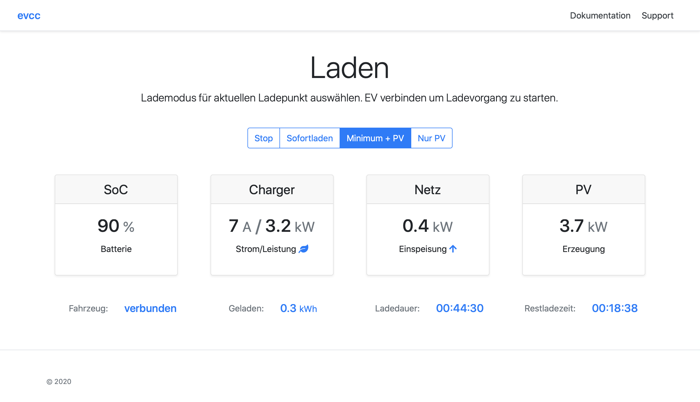

# evcc 🚘☀️

[](https://github.com/evcc-io/evcc/actions?query=workflow%3ABuild)
[](https://goreportcard.com/report/github.com/evcc-io/evcc)
[](https://open.vscode.dev/evcc-io/evcc)
[](https://cloudsmith.io/~evcc/packages/)
[](https://github.com/evcc-io/evcc/releases)

<!-- [](https://hub.docker.com/r/andig/evcc) -->
<!-- [](https://www.paypal.com/cgi-bin/webscr?cmd=_s-xclick&hosted_button_id=48YVXXA7BDNC2) -->

evcc is an extensible EV Charge Controller with PV integration implemented in [Go][2]. Featured in [PV magazine](https://www.pv-magazine.de/2021/01/15/selbst-ist-der-groeoenlandhof-wallbox-ladesteuerung-selbst-gebaut/).



## Features

- simple and clean user interface
- wide range of supported [chargers](https://docs.evcc.io/docs/devices/chargers):
  - ABL eMH1, Alfen (Eve), Bender (CC612/613), cFos (PowerBrain), Daheimladen, Ebee (Wallbox), Ensto (Chago Wallbox), [EVSEWifi/ smartWB](https://www.evse-wifi.de), Garo (GLB, GLB+, LS4), go-eCharger, HardyBarth (eCB1, cPH1, cPH2), Heidelberg (Energy Control), Innogy (eBox), Juice (Charger Me), KEBA/BMW, Menneckes (Amedio, Amtron Premium/Xtra, Amtron ChargeConrol), NRGkick, [openWB (includes Pro)](https://openwb.de/), Optec (Mobility One), PC Electric (includes Garo), TechniSat (Technivolt), [Tinkerforge Warp Charger](https://www.warp-charger.com), Ubitricity (Heinz), Vestel, Wallbe, Webasto (Live), Mobile Charger Connect
  - experimental EEBus support (Elli, PMCC)
  - experimental OCPP support
  - Build-your-own: Phoenix (includes ESL Walli), [EVSE DIN](https://www.evse-wifi.de/produkt-schlagwort/simple-evse-wb/)
  - Smart-Home outlets: FritzDECT, Shelly, Tasmota, TP-Link
- wide range of supported [meters](https://docs.evcc.io/docs/devices/meters) for grid, pv, battery and charger:
  - ModBus: Eastron SDM, MPM3PM, ORNO WE, SBC ALE3 and many more, see <https://github.com/volkszaehler/mbmd#supported-devices> for a complete list
  - Integrated systems: SMA Sunny Home Manager and Energy Meter, KOSTAL Smart Energy Meter (KSEM, EMxx)
  - Sunspec-compatible inverter or home battery devices: Fronius, SMA, SolarEdge, KOSTAL, STECA, E3DC, ...
  - and various others: Discovergy, Tesla PowerWall, LG ESS HOME, OpenEMS (FENECON)
- [vehicle](https://docs.evcc.io/docs/devices/vehicles) integration (state of charge, remote charge, battery and preconditioning status):
  - Audi, BMW, Citroën, Dacia, Fiat, Ford, Hyundai, Jaguar, Kia, Landrover, Mercedes, Mini, Nissan, Opel, Peugeot, Porsche, Renault, Seat, Smart, Skoda, Tesla, Volkswagen, Volvo
  - Services: OVMS, Tronity
  - Scooters: Niu, Silence
- [plugins](https://docs.evcc.io/docs/reference/plugins) for integrating with any charger/ meter/ vehicle:
  - Modbus, HTTP, MQTT, Javascript, WebSockets and shell scripts
- status [notifications](https://docs.evcc.io/docs/reference/configuration/messaging) using [Telegram](https://telegram.org), [PushOver](https://pushover.net) and [many more](https://containrrr.dev/shoutrrr/)
- logging using [InfluxDB](https://www.influxdata.com) and [Grafana](https://grafana.com/grafana/)
- granular charge power control down to mA steps with supported chargers (labeled by e.g. smartWB als [OLC](https://board.evse-wifi.de/viewtopic.php?f=16&t=187))
- REST and MQTT [APIs](https://docs.evcc.io/docs/reference/api) for integration with home automation systems
- HomeAssistant [add-on](https://github.com/evcc-io/evcc-hassio-addon)

## Getting Started

You'll find everything you need in our [documentation](https://docs.evcc.io/) (German).

## Contribute

To build evcc from source, [Go][2] 1.18 and [Node][3] 18 are required.

Build and run go backend. The UI becomes available at http://127.0.0.1:7070/

```sh
make
./evcc
```

For frontend development start the Vue toolchain in dev-mode. Open http://127.0.0.1:7071/ to get to the livelreloading development server. It pulls its data from port 7070 (see above).

```sh
npm install
npm run start
```

### Code formatting

We use linters (golangci-lint, Prettier) to keep a coherent source code formatting. It's recommended to use the format-on-save feature of your editor. For VSCode use the [Go](https://marketplace.visualstudio.com/items?itemName=golang.Go), [Prettier](https://marketplace.visualstudio.com/items?itemName=esbenp.prettier-vscode) and [Veture](https://marketplace.visualstudio.com/items?itemName=octref.vetur) extension. You can manually reformat your code by running:

```sh
make lint
make lint-ui
```

### Changing UI code

To ensure reproducability the build frontend artifacts are part of the source code repository. If you've made changes to frontend code, please make sure to rebuild the production assets before you commit.

```sh
make ui
```

### Changing templates

evcc supports a massive amount of different devices. To keep our documentation and website in sync with the latest software the core project (this repo) generates meta-data that's pushed to the `docs` and `evcc.io` repository. Make sure to update this meta-data every time you make changes to a templates.

```sh
make docs
```

If you miss one of the above steps Gitub Actions will likely trigger a **Porcelain** error.

## Sponsorship

evcc believes in open source software. We're committed to provide best in class EV charging experience.
Maintaining evcc consumes time and effort. With the vast amount of different devices to support, we depend on community and vendor support to keep evcc alive.

While evcc is open source, we would also like to encourage vendors to provide open source hardware devices, public documentation and support open source projects like ours that provide additional value to otherwise closed hardware. Where this is not the case, evcc requires "sponsor token" to finance ongoing development and support of evcc.

The personal sponsor token requires a [Github Sponsorship](https://github.com/sponsors/andig) and can be requested at [cloud.evcc.io](https://cloud.evcc.io/). A sponsor token is valid for one year and can be renewed any time with active sponsorship.

## Background


evcc is heavily inspired by [OpenWB][1]. However, in 2019, I found OpenWB's architecture slightly intimidating with everything basically global state and heavily relying on shell scripting. On the other side, especially the scripting aspect is one that contributes to OpenWB's flexibility.

Hence, for a simplified and stricter implementation of an EV charge controller, the design goals for evcc were:

- typed language with ability for systematic testing - achieved by using [Go][2]
- structured configuration - supports YAML-based [config file](evcc.dist.yaml)
- avoidance of feature bloat, simple and clean UI - utilizes [Vue.js][4] and [Bootstrap][5]
- containerized operation beyond Raspberry Pi - provide multi-arch [Docker Image][6]

[1]: https://github.com/snaptec/openWB
[2]: https://golang.org
[3]: https://nodejs.org/
[4]: https://vuejs.org
[5]: https://getbootstrap.org
[6]: https://hub.docker.com/r/andig/evcc
