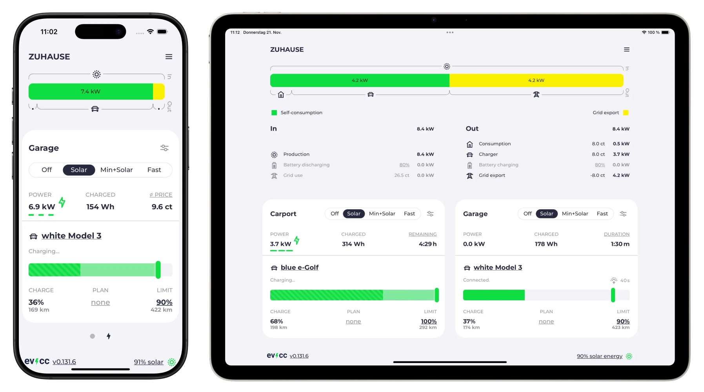

# evcc 🚘☀️

 

evcc is an extensible EV Charge Controller and home energy management system.

Our goal is to provide local energy management, without relying on cloud services.
Featured in [PV Magazine](https://www.pv-magazine.de/2022/01/14/mit-open-source-lademanager-schnittstellen-zu-wallbox-und-photovoltaik-anlage-meistern/) and [c’t Magazin](https://www.youtube.com/watch?v=MoBpEXHMNjI).

## Features

- simple and clean user interface
- support for many [EV chargers](https://docs.evcc.io/en/docs/devices/chargers):
  - ABB, ABL, Alfen, Alphatec, Amperfied, Ampure, Audi, AUTEL, Autoaid, Bender, BMW, cFos, Charge Amps, Compleo, CUBOS, Cupra, Dadapower, DaheimLaden, Delta, E.ON Drive, E3/DC, Easee, Ebee, echarge, EcoHarmony, Edgetech, Elecq, eledio, Elli, EM2GO, EN+, enercab, Ensto, EntraTek, ESL, eSystems, Etrel, EVBox, Free2Move, Free2move eSolutions, Fronius, Garo, go-e, Hardy Barth, Heidelberg, Hesotec, Homecharge, Huawei, Innogy, INRO, Juice, Kathrein, KEBA, Kontron Solar, Kostal, KSE, LadeFoxx, LRT, Mennekes, NRGkick, OBO Bettermann, OpenEVSE, openWB, Optec, Orbis, PC Electric, Peblar, Phoenix Contact, Plugchoice, Porsche, Pracht, Pulsares, Pulsatrix, Qcells, Schneider, Schrack, SENEC, Siemens, Skoda, SMA, Smartfox, SolarEdge, Solax, Sonnen, Spelsberg, Stark in Strom, Sungrow, TechniSat, Tesla, Tigo, TinkerForge, Ubitricity, V2C Trydan, Vestel, Victron, Viridian EV, Volkswagen, Volt Time, Wallbe, wallbox, Walther Werke, Webasto, Weidmüller, Zaptec, ZJ Beny. [Read more.](https://docs.evcc.io/en/docs/devices/chargers)
  - **EEBus** support (Elli, PMCC)
  - **OCPP** support
  - **build-your-own:** Phoenix Contact (includes ESL Walli), EVSE DIN
  - **smart switches:** AVM, FRITZ!, Home Assistant, Homematic IP, HomeWizard, myStrom, Shelly, Tasmota, TP-Link. [Read more.](https://docs.evcc.io/en/docs/devices/smartswitches)
  - **heat pumps and electric heaters:** alpha innotec, Bosch, Buderus, Bösch, CTA All-In-One, Daikin, Elco, IDM, Junkers, Kermi, Lambda, my-PV, Nibe, Novelan, Roth, Stiebel Eltron, Tecalor, Vaillant, Viessmann, Wolf, Zewotherm. [Read more.](https://docs.evcc.io/en/docs/devices/heating)
- support for many [energy meters](https://docs.evcc.io/en/docs/devices/meters):
  - **solar inverters and battery systems:** A-Tronix, Acrel, Ads-tec, Alpha ESS, Ampere, Anker, APsystems, AVM, Axitec, BGEtech, Bosch, Bosswerk, Carlo Gavazzi, Deye, E3/DC, Eastron, Enphase, FENECON, FRITZ!, FoxESS, Fronius, Ginlong, go-e, GoodWe, Growatt, Homematic IP, HomeWizard, Hoymiles, Huawei, IAMMETER, IGEN Tech, Kostal, LG, Loxone, M-TEC, Marstek, myStrom, OpenEMS, Powerfox, Qcells, RCT, SAJ, SAX, SENEC, Senergy, Shelly, Siemens, Sigenergy, SMA, Smartfox, SofarSolar, Solaranzeige, SolarEdge, SolarMax, Solarwatt, Solax, Solinteng, Sonnen, St-ems, Steca, Sungrow, Sunsynk, Sunway, Tasmota, Tesla, TP-Link, VARTA, Victron, Wattsonic, Youless, ZCS Azzurro, Zendure. [Read more.](https://docs.evcc.io/en/docs/devices/meters)
  - **general energy meters:** A-Tronix, ABB, Acrel, Alpha ESS, Ampere, AVM, Axitec, Bernecker Engineering, BGEtech, Bosch, Carlo Gavazzi, cFos, Deye, DSMR, DZG, E3/DC, Eastron, Enphase, ESPHome, FENECON, FoxESS, FRITZ!, Fronius, Ginlong, go-e, GoodWe, Growatt, Homematic IP, HomeWizard, Huawei, IAMMETER, inepro, IOmeter, Janitza, KEBA, Kostal, LG, Loxone, M-TEC, mhendriks, my-PV, myStrom, OpenEMS, ORNO, P1Monitor, Powerfox, Qcells, RCT, Saia-Burgess Controls (SBC), SAJ, SAX, Schneider Electric, SENEC, Shelly, Siemens, Sigenergy, SMA, Smartfox, SofarSolar, Solaranzeige, SolarEdge, SolarMax, Solarwatt, Solax, Solinteng, Sonnen, St-ems, Sungrow, Sunsynk, Sunway, Tasmota, Tesla, Tibber, TQ, VARTA, Victron, Volkszähler, Wago, Wattsonic, Weidmüller, Youless, ZCS Azzurro, Zuidwijk. [Read more.](https://docs.evcc.io/en/docs/devices/meters)
  - **integrated systems**: SMA Sunny Home Manager and Energy Meter, KOSTAL Smart Energy Meter (KSEM, EMxx)
  - **sunspec**-compatible inverter or home battery devices
  - **mbmd**-compatible devices, see [volkszaehler/mbmd](https://github.com/volkszaehler/mbmd#supported-devices) for a complete list
- [vehicle](https://docs.evcc.io/en/docs/devices/vehicles) integrations (state of charge, remote charge, battery and preconditioning status):
  - Aiways, Audi, BMW, Citroën, Dacia, DS, Fiat, Ford, Hyundai, Jeep, Kia, Mercedes-Benz, MG, Mini, Nissan, NIU, Opel, Peugeot, Polestar, Renault, Seat, Skoda, Smart, Subaru, Tesla, Toyota, Volkswagen, Volvo, Zero Motorcycles. [Read more.](https://docs.evcc.io/en/docs/devices/vehicles)
  - **services:** OVMS, Tronity, evNotify, ioBroker.bmw, mg2mqtt, mz2mqtt, TeslaLogger, TeslaMate, Tessi, volvo2mqtt
- [plugins](https://docs.evcc.io/en/docs/devices/plugins) for integrating with any charger, smartswitch, heatpump, electric heater, meter, solar- / battery-inverter or vehicle:
  - Modbus, HTTP, MQTT, JavaScript, WebSocket, Go and shell scripts
- status [notifications](https://docs.evcc.io/en/docs/reference/configuration/messaging) using [Telegram](https://telegram.org), [PushOver](https://pushover.net) and [many more](https://containrrr.dev/shoutrrr/)
- logging using [InfluxDB](https://www.influxdata.com) and [Grafana](https://grafana.com/grafana/)
- [REST](https://docs.evcc.io/en/docs/integrations/rest-api) and [MQTT](https://docs.evcc.io/en/docs/integrations/mqtt-api) APIs for integration with home automation systems
- Add-ons for [Home Assistant](https://docs.evcc.io/en/docs/integrations/home-assistant) and [openHAB](https://www.openhab.org/addons/bindings/evcc) (not maintained by the evcc core team)

## Getting Started

You'll find everything you need in our [documentation](https://docs.evcc.io/en/).

## Contributing

Technical details on how to contribute, how to add translations and how to build evcc from source can be found [here](CONTRIBUTING.md).

## Sponsorship

evcc believes in open source software. We're committed to provide best in class EV charging experience.
Maintaining evcc consumes time and effort. With the vast amount of different devices to support, we depend on community and vendor support to keep evcc alive.

While evcc is open source, we would also like to encourage vendors to provide open source hardware devices, public documentation and support open source projects like ours that provide additional value to otherwise closed hardware. Where this is not the case, evcc requires "sponsor token" to finance ongoing development and support of evcc.

Learn more about our [sponsorship model](https://docs.evcc.io/en/docs/sponsorship).

## License

This project is licensed under the MIT License. See the [LICENSE](LICENSE) file for details.

For additional license information regarding fonts, icons, and other assets, please see the [LICENSES](LICENSES/) folder.

**Note:** All sponsor-required components are excluded from the MIT License.
See file license header for details.
If you want to use them in your own project, one evcc sponsorship token is required per evcc instance.
Custom licensing agreements are available - please [contact us](mailto:info@evcc.io) to discuss your specific requirements.
