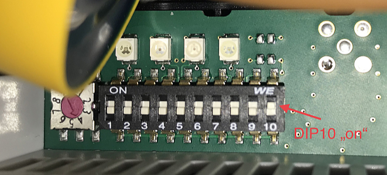

# evcc <!-- omit in toc -->

[](https://open.vscode.dev/evcc-io/evcc)
[](https://github.com/evcc-io/evcc/actions?query=workflow%3ABuild)
[](https://goreportcard.com/report/github.com/evcc-io/evcc)
[](https://github.com/evcc-io/evcc/releases)
[](https://hub.docker.com/r/evcc-io/evcc)
[](https://www.paypal.com/cgi-bin/webscr?cmd=_s-xclick&hosted_button_id=48YVXXA7BDNC2)

EVCC is an extensible EV Charge Controller with PV integration implemented in [Go][2]. Featured in [PV magazine](https://www.pv-magazine.de/2021/01/15/selbst-ist-der-groeoenlandhof-wallbox-ladesteuerung-selbst-gebaut/).

## Features <!-- omit in toc -->

- simple and clean user interface
- multiple [chargers](#charger):
  - Open source: [openWB](https://openwb.de/), [EVSEWifi](https://www.evse-wifi.de) (includes smartWB)
  - Other commercial: ABL eMH1, Alfen Eve, cFos PowerBrain, Daheimladen, go-eCharger, Heidelberg Energy Control, KEBA/BMW, NRGkick, Wallbe, Mobile Charger Connect, EEBUS (experimental)
  - Build-your-own: Phoenix (includes ESL Walli), [SimpleEVSE](https://www.evse-wifi.de/produkt-schlagwort/simple-evse-wb/)
  - Smart-Home outlets: FritzDECT, Shelly, Tasmota, TP-Link
- multiple [meters](#meter): ModBus (Eastron SDM, MPM3PM, SBC ALE3 and many more), Discovergy (using HTTP plugin), SMA Sunny Home Manager and Energy Meter, KOSTAL Smart Energy Meter (KSEM, EMxx), any Sunspec-compatible inverter or home battery devices (Fronius, SMA, SolarEdge, KOSTAL, STECA, E3DC, ...), Tesla PowerWall, LG ESS HOME
- wide support of vendor-specific [vehicles](#vehicle) interfaces (remote charge, battery and preconditioning status): Audi, BMW, Fiat, Ford, Hyundai, Kia, Mini, Nissan, Niu, Porsche, Renault, Seat, Skoda, Tesla, Volkswagen, Volvo, Tronity
- [plugins](#plugins) for integrating with any charger/ meter/ vehicle: Modbus (meters and grid inverters), HTTP, MQTT, Javascript, WebSockets and shell scripts
- status notifications using [Telegram](https://telegram.org), [PushOver](https://pushover.net) and [many more](https://containrrr.dev/shoutrrr/)
- logging using [InfluxDB](https://www.influxdata.com) and [Grafana](https://grafana.com/grafana/)
- granular charge power control down to mA steps with supported chargers (labeled by e.g. smartWB als [OLC](https://board.evse-wifi.de/viewtopic.php?f=16&t=187))
- REST and MQTT [APIs](#api) for integration with home automation systems (e.g. [HomeAssistant](https://github.com/evcc-io/evcc-hassio-addon))


## Index <!-- omit in toc -->

- [Getting started](#getting-started)
- [Installation](#installation)
- [Configuration](#configuration)
  - [Site](#site)
  - [Loadpoint](#loadpoint)
  - [Charger](#charger)
  - [Meter](#meter)
  - [Vehicle](#vehicle)
  - [Home Energy Management System](#home-energy-management-system)
  - [Flexible Energy Tariffs](#flexible-energy-tariffs)
- [Plugins](#plugins)
  - [Modbus (read/write)](#modbus-readwrite)
  - [MQTT (read/write)](#mqtt-readwrite)
  - [HTTP (read/write)](#http-readwrite)
  - [Websocket (read only)](#websocket-read-only)
  - [SMA/Speedwire (read only)](#smaspeedwire-read-only)
  - [Javascript (read/write)](#javascript-readwrite)
  - [Shell Script (read/write)](#shell-script-readwrite)
  - [Calc (read only)](#calc-read-only)
  - [Combined status (read only)](#combined-status-read-only)
- [API](#api)
  - [REST API](#rest-api)
  - [MQTT API](#mqtt-api)
- [Sponsorship](#sponsorship)
- [Background](#background)


## Getting started

1. Install EVCC. For details see [installation](#installation).
2. Copy the default configuration file `evcc.dist.yaml` to `evcc.yaml` and open for editing.
    We recommend to use an editor like [VS Code](https://code.visualstudio.com) with the [YAML extension](https://marketplace.visualstudio.com/items?itemName=redhat.vscode-yaml) for syntax highlighting.
3. To create a minimal setup you need a [meter](#meter) (either grid meter or pv generation meter) and a supported [charger](#charger). Many PV inverters contain meters that can be used here.
4. Configure both meter(s) and charger by:

    - choosing the appropriate `type`
    - add a `name` attribute than can later be referred to
    - add configuration details depending on `type`

    See `evcc.dist.yaml` for examples.

5. Configure an optional vehicle by choosing the appropriate `type` and adding a `name` attribute than can later be referred to.
6. Test your meter, charger and optional vehicle configuration by running

    ```sh
    evcc meter|charger|vehicle
    ```

7. Configure the `site` and assign the grid- or PV meter using the defined `name` attributes.
8. Configure a `loadpoint` and assign the _charge meter_, charger and vehicle using the defined `name` attributes.
9. Provide optional configuration for MQTT, push messaging, database logging and more.

## Installation

EVCC is provided as binary executable file and Docker image. Download the file for your platform and then execute like this:

```sh
evcc -h
```

Use the following `systemd` unit description to configure EVCC as service (put into `/etc/systemd/system/evcc.service`):

```none
[Unit]
Description=evcc
After=syslog.target network-online.target
Wants=network-online.target
[Service]
ExecStart=/usr/local/bin/evcc --log error
Restart=always
[Install]
WantedBy=multi-user.target
```

EVCC can also be run using Docker. Here's and example with given config file and UI on port 7070:

```sh
docker run -v $(pwd)/evcc.dist.yaml:/etc/evcc.yaml -p 7070:7070 andig/evcc -h
```

**Note**: don't mount `/etc` as volume as this will effectively remove the entire folder from the container and will lead to hard to diagnose errors.

If using Docker with a meter or charger that requires UDP like KEBA, make sure that the Docker container can receive UDP messages on the relevant ports (`:7090` for KEBA):

```sh
docker run -p 7070:7070 -p 7090:7090/udp andig/evcc ...
```

When using Docker with a device that requires multicast UDP like SMA, make sure that the Docker container uses the `network_mode: host` configuration:

```sh
docker run --network host andig/evcc ...
```

For use with SMA Sunny Home Manager, `evcc` needs to generate a unique device id. On Linux, we're using `machine-id` for this purpose, make sure to mount the host folders into the container:

```sh
docker run -v /etc/machine-id:/etc/machine-id -v /var/lib/dbus/machine-id:/var/lib/dbus/machine-id andig/evcc ...
```

To build EVCC from source, [Go][2] 1.16 is required:

```sh
make
```

**Note**: EVCC comes without any guarantee. You are using this software **entirely** at your own risk. It is your responsibility to verify it is working as intended.
EVCC requires a supported charger and a combination of grid, PV and charge meter.
All components **must** be installed by a certified professional.

## Configuration

The EVCC consists of five basic elements: _Site_ and _Loadpoints_ describe the infrastructure and combine *Charger*s, *Meter*s and *Vehicle*s.

### Site

A site describes the grid connection and is responsible for managing the available power. A minimal site configuration requires a grid meter for managing EVU demand and optionally a PV or battery meter.

```yaml
site:
- title: Zuhause # display name for UI
  meters:
    grid: sdm630 # grid meter reference
    pv: sma # pv meter reference
```

### Loadpoint

Loadpoints combine meters, charger and vehicle together and add optional configuration. A minimal loadpoint configuration requires a charger and optionally a separate charge meter. If charger has an integrated meter it will automatically be used:

```yaml
loadpoints:
- title: Garage # display name for UI
  charger: wallbe # charger reference
  vehicle: audi # vehicle reference
  meters:
    charge: sdm630 # grid meter reference
```

More options are documented in the `evcc.dist.yaml` sample configuration.

#### Charge modes <!-- omit in toc -->

The default _charge mode_ upon start of EVCC is configured on the loadpoint. Multiple charge modes are supported:

- **Off**: disable the charger, even if car gets connected.
- **Now** (**Sofortladen**): charge immediately with maximum allowed current.
- **Min + PV**: charge immediately with minimum configured current. Additionally use PV if available.
- **PV**: use PV as available. May not charge at all or may interrupt charging if PV production is too low or other consuption is too high.

In general, due to the minimum value of 5% for signalling the EV duty cycle, the charger cannot limit the current to below 6A. If the available power calculation demands a limit less than 6A, handling depends on the charge mode. In **PV** mode, the charger will be disabled until available PV power supports charging with at least 6A. In **Min + PV** mode, charging will continue at minimum current of 6A and charge current will be raised as PV power becomes available again. **Min + PV** mode may behave different, when used with [HEMS (SHM)](#home-energy-management-system). Please note that not all vehicles support charging with very low current limits at all or only under special circumstances. For these type of vehicles the minimum allowed charge current needs to be raised.

### Charger

Charger is responsible for handling EV state and adjusting charge current.
Available charger implementations are:

- `abl`: ABL eMH1 (requires Modbus adapter; [sponsors only](#sponsorship))
- `alfen`: Alfen Eve (Single and Double, NG platform, [sponsors only](#sponsorship))
- `cfos`: cFos PowerBrain charger (meters must configured separately, [sponsors only](#sponsorship))
- `daheimladen`: Daheimladen charger (request your access token from [Daheimladen Support](info@daheimladen.de), [sponsors only](#sponsorship))
- `easee`: Easee Home charger ([sponsors only](#sponsorship))
- `eebus`: EEBUS compatible chargers (experimental)
- `evsewifi`: chargers with SimpleEVSE controllers using [EVSE-WiFi](https://www.evse-wifi.de/) (includes smartWB)
- `go-e`: go-eCharger chargers (both local and cloud API are supported, at least firmware 040.0 required)
- `heidelberg`: Heidelberg Energy Control (requires Modbus adapter; [sponsors only](#sponsorship))
- `keba`: KEBA KeContact P20/P30 and BMW chargers (see [Preparation](#keba-preparation-))
- `mcc`: Mobile Charger Connect devices (Audi, Bentley, Porsche)
- `nrgkick-bluetooth`: NRGkick chargers with Bluetooth connector (Linux only, not supported on Docker)
- `nrgkick-connect`: NRGkick chargers with additional NRGkick Connect module
- `openWB`: openWB chargers using openWB's MQTT interface (set `phases: true` to indicate if openWB is equipped with 1p3p capability- currently this cannot be auto detected)
- `phoenix-em-eth`: chargers with Phoenix **EM**-CP-PP-**ETH** controllers
- `phoenix-ev-eth`: chargers with Phoenix **EV**-CC-\*\*\*-**ETH** controllers (see [Preparation](#phoenix-emev-ethernet-controller-preparation-))
- `phoenix-ev-ser`: chargers with Phoenix **EV**-CC-\*\*\*-**SER** serial controllers (Modbus RTU)
- `simpleevse`: chargers with SimpleEVSE controllers connected via ModBus (e.g. OpenWB Wallbox, Easy Wallbox B163, ...)
- `wallbe`: Wallbe Eco chargers (see [Preparation](#wallbe-preparation-)). For older Wallbe boxes (pre 2019) with Phoenix EV-CC-AC1-M3-CBC-RCM-ETH controllers make sure to set `legacy: true` to enable correct current configuration.
- `warp`: Tinkerforge Warp/ Warp Pro charger
- `custom`: default charger implementation using configurable [plugins](#plugins) for integrating any type of charger

Smart-Home outlet charger implementations:

- `fritzdect`: Fritz!DECT 200/210 outlets
- `shelly`: Shelly outlets
- `tasmota`: Tasmota outlets
- `tplink`: TP-Link HSXXX series outlets

Configuration examples are documented at [evcc-io/config#chargers](https://github.com/evcc-io/config#chargers)

#### EEBUS (experimental) preparation <!-- omit in toc -->

1. Run `evcc eebus-cert`
2. Add the output to the `evcc.yaml` configuration file
3. Open the web interface of the charger to get the chargers SKI (Identifcation Number)
   For Porsche Mobile Charger Connect this is available in the top menu "Connections" sub-menu "Energy Manager"
4. Add the charger to your configuration:
   ```
   chargers:
   - name: mcc
     type: eebus
     ski: 1234-5678-9012-3456-7890-1234-5678-9012-3456
   ```
5. Run `evcc`
6. On the web interface of the charger typically in the page showing the chargers SKI, `EVCC` should be shown including an option to pair the charger with `EVCC`. Do just that.
7. The EVCC web interface should show the charger and status of a connected car and allow to charge

#### KEBA preparation <!-- omit in toc -->

KEBA chargers require UDP function to be enabled with DIP 1.3 = `ON`, see KEBA installation manual.

#### Phoenix EM/EV ethernet controller preparation <!-- omit in toc -->

The EM/EV ethernet controllers requires DIP 10 = `ON` be controlled by ModBus, see controller manual.

#### Wallbe preparation <!-- omit in toc -->

Wallbe chargers are supported out of the box. The Wallbe must be connected using Ethernet. If not configured, the default address `192.168.0.8:502` is used.

To allow controlling charge start/stop, the Wallbe physical configuration must be modified. This requires opening the Wallbe. Once opened, DIP 10 must be set to ON:



More information on interacting with Wallbe chargers can be found at [GoingElectric](https://www.goingelectric.de/forum/viewtopic.php?p=1212583). Use with care.

**NOTE:** The Wallbe products come in two flavors. Older models (2017 known to be "old", 2019 known to be "new") use the Phoenix EV-CC-AC1-M3-CBC-RCM controller. For such models make sure to set `legacy: true`. You can find you which one you have using [MBMD][6]:

```sh
mbmd read -a 192.168.0.8:502 -d 255 -t holding -e int 300 1
```

Compare the value to what you see as _Actual Charge Current Setting_ in the Wallbe web UI. If the numbers match, it's a Phoenix controller, if the reading is factor 10x the UI value then it's a Wallbe controller.

**NOTE:** Opening the wall box **must** only be done by certified professionals. The box **must** be disconnected from mains before opening.

### Meter

Meters provide data about power and energy consumption, PV production or battery utilization. A meter defines a point of power delivery and can be an actual physical meter (e.g. a grid meter), a PV inverter (AC or even DC power in case of hybrid inverters), or a home battery.

Chargers may also contain internal or attached meters. If the charger contains an internal meter, there's no need to configure the charge meter separately. If no charge meter is configured, EVCC will use the charger-attached meter (if exists) or assume the configured charger power as meter value.

EVCC uses positive (+) sign for incoming energy (grid consumption, PV inverter production or home battery discharge) and negative (-) sign for outgoing energy (grid export, PV inverter remaining usage or home battery charge). All remaining home power usage, including the charger, is always of positive (+) sign.

Available meter implementations are:

- `modbus`: ModBus meters as supported by [MBMD](https://github.com/volkszaehler/mbmd#supported-devices). Configuration is similar to the [ModBus plugin](#modbus-readwrite) where `power` and `energy` specify the MBMD measurement value to use. Additionally, `soc` can specify an MBMD measurement value for home battery soc. Typical values are `power: Power`, `energy: Sum` and `soc: ChargeState` where only `power` applied per default.
- `lgess`: LG ESS HOME meter. Use `usage` to choose meter type: `grid`/`pv`/`battery`. Use `uri` to configure the URI of the LG ESS HOME. Use `password` to configure the password required to access the LG ESS HOME. `uri` and `password` only need to be provided once if multiple usages are defined.
- `openwb`: OpenWB meters. Use `usage` to choose meter type: `grid`/`pv`/`battery`.
- `sma`: SMA Home Manager 2.0, SMA Energy Meter and Inverters via SMA Speedwire.
- `tesla`: Tesla PowerWall meter. Use `usage` to choose meter type: `grid`/`pv`/`battery`.
- `custom`: default meter implementation where meter readings- `power`, `energy`, per-phase `currents` and battery `soc` are configured using [plugins](#plugins)

Configuration examples are documented at [evcc-io/config#meters](https://github.com/evcc-io/config#meters)

### Vehicle

Vehicle represents a specific EV vehicle and its battery. If vehicle is configured and assigned to the charger, charge status and remaining charge duration become available in the user interface.

Available vehicle remote interface implementations are:

- `audi`: Audi (eTron, Q55)
- `bmw`: BMW (i3)
- `carwings`: Nissan (Leaf pre 2019)
- `citroen`, `ds`, `opel`, `peugeot`: All PSA brands
- `fiat`: Fiat (500e, Neuer 500)
- `ford`: Ford (Kuga, Mustang)
- `kia`: Kia (Soul and other Bluelink models)
- `hyundai`: Hyundai (Bluelink vehicles like Kona or Ioniq)
- `mini`: Mini (Cooper SE)
- `nissan`: Nissan (Leaf)
- `niu`: Niu Scooter
- `tesla`: Tesla (any model)
- `renault`: Renault (all ZE models: Zoe, Twingo Electric, Master, Kangoo)
- `ovms`: Open Vehicle Monitoring System (f.i. Twizzy, Smart ED)
- `porsche`: Porsche (Taycan, Cayenne E-Hybrid)
- `seat`: Seat (Cupra, Mii)
- `skoda`: Skoda (Citigo)
- `enyaq`: Skoda (Enyaq)
- `vw`: Volkswagen (eGolf, eUp)
- `id`: Volkswagen (ID.3, ID.4)
- `volvo`: Volvo
- `tronity`: Tronity ([sponsors only](#sponsorship))
- `custom`: default vehicle implementation using configurable [plugins](#plugins) for integrating any type of vehicle

Configuration examples are documented at [evcc-io/config#vehicles](https://github.com/evcc-io/config#vehicles)

### Home Energy Management System

EVCC can integrate itself with Home Energy Management Systems. At this time, the SMA Home Manager (SHM) is the only supported system. To enable add

```yaml
hems:
  type: sma
  allowcontrol: false # set true to allow SHM controlling charger in PV modes
```

to the configuration. The EVCC loadpoints can then be added to the SHM configuration. When SHM is used, the ratio of Grid to PV Power for the **Min+PV** mode can be adjusted in
Sunny-Portal via the "Optional energy demand" slider. When the amount of configured PV is not available, charging suspends like in **PV** mode. So, pushing the slider completely
to the left makes **Min+PV** behave as described above. Pushing completely to the right makes **Min+PV** mode behave like **PV** mode.

### Flexible Energy Tariffs

EVCC supports flexible energy tariffs as offered by [Awattar](https://www.awattar.de) or [Tibber](https://tibber.com). Configuration allows to define a "cheap" rate at which charging from grid is enabled at highest possible rate even when not enough PV power is locally available:

```yaml
tariffs:
  grid:
    # either
    type: tibber
    cheap: 20 # ct/kWh
    token: "476c477d8a039529478ebd690d35ddd80e3308ffc49b59c65b142321aee963a4" # access token
    homeid: "cc83e83e-8cbf-4595-9bf7-c3cf192f7d9c" # optional if multiple homes associated to account

    # or
    type: awattar
    cheap: 20 # ct/kWh
    region: de # optional, choose at for Austria
```

## Plugins

Plugins are used to integrate various devices and external data sources with EVCC. Plugins can be used in combination with a `custom` type meter, charger or vehicle.

Plugins support both _read_ and _write_ access. When using plugins for _write_ access, the actual data is provided as variable in form of `${var[:format]}`. If `format` is omitted, data is formatted according to the default Go `%v` [format](https://golang.org/pkg/fmt/). The variable is replaced with the actual data before the plugin is executed.

### Modbus (read/write)

The `modbus` plugin is able to read data from any Modbus meter or SunSpec-compatible solar inverter. Many meters are already pre-configured (see [MBMD Supported Devices](https://github.com/volkszaehler/mbmd#supported-devices)). It also supports writing Modbus registers for integration of additional chargers.

The meter configuration consists of the actual physical connection and the value to be read.

#### Physical connection <!-- omit in toc -->

If the device is physically connected using an RS485 adapter, `device` and serial configuration `baudrate`, `comset` must be specified:

```yaml
source: modbus
device: /dev/ttyUSB0
baudrate: 9600
comset: "8N1"
```

If the device is a grid inverter or a Modbus meter connected via TCP, `uri` must be specified:

```yaml
source: modbus
uri: 192.168.0.11:502
id: 1 # modbus slave id
```

If the device is a Modbus RTU device connected using an RS485/Ethernet adapter, set `rtu: true`. The serial configuration must be done directly on the adapter. Example:

```yaml
source: modbus
uri: 192.168.0.10:502
id: 3 # modbus slave id
rtu: true
```

#### Logical connection <!-- omit in toc -->

The device's type `model` and the device's slave id `id` are always required:

```yaml
source: modbus
uri/device/id: ...
model: sdm
value: Power
scale: -1 # floating point factor applied to result, e.g. for kW to W conversion
```

Supported meter models are the same as supported by [MBMD](https://github.com/volkszaehler/mbmd#supported-devices):

- RTU:
  - `ABB` ABB A/B-Series meters
  - `MPM` Bernecker Engineering MPM3PM meters
  - `DZG` DZG Metering GmbH DVH4013 meters
  - `INEPRO` Inepro Metering Pro 380
  - `JANITZA` Janitza B-Series meters
  - `SBC` Saia Burgess Controls ALD1 and ALE3 meters
  - `SDM` Eastron SDM630
  - `SDM220` Eastron SDM220
  - `SDM230` Eastron SDM230
  - `SDM72` Eastron SDM72
  - `ORNO1P` ORNO WE-514 & WE-515
  - `ORNO3P` ORNO WE-516 & WE-517
- TCP: Sunspec-compatible grid inverters (SMA, SolarEdge, Kaco, KOSTAL, Fronius, Steca etc)

Use `value` to define the value to read from the device. All values that are supported by [MBMD](https://github.com/volkszaehler/mbmd/blob/master/meters/measurements.go#L28) are pre-configured.

In case of SunSpec-compatible inverters, values can also be configured in the form of `model:[block:]point` according to SunSpec definition. For example, a 3-phase inverter's DC power of the 2nd string would be configurable as `103:2:W`.

#### Manual configuration <!-- omit in toc -->

If the Modbus device is not supported by MBMD, the Modbus register can also be manually configured:

```yaml
source: modbus
uri/device/id: ...
register:
  address: 40070
  source: holding # holding or input
  decode: int32 # int16|32|64, uint16|32|64, float32|64 and u|int32s + float32s
scale: -1 # floating point factor applied to result, e.g. for kW to W conversion
```

The `int32s/uint32s` decodings apply swapped word order and are useful e.g. with E3/DC devices.

To write a register use `type: writesingle` which writes a single 16bit register (either `int` or `bool`). The encoding is always `uint16` in this case.

### MQTT (read/write)

The `mqtt` plugin allows to read values from MQTT topics. This is particularly useful for meters, e.g. when meter data is already available on MQTT. See [MBMD][6] for an example how to get Modbus meter data into MQTT. Includes the ability to read and parse JSON using jq-like queries (see [HTTP plugin](#http-readwrite)).

Sample configuration:

```yaml
source: mqtt
topic: mbmd/sdm1-1/Power
timeout: 30s # don't accept values older than timeout
scale: 0.001 # floating point factor applied to result, e.g. for Wh to kWh conversion
```

Sample write configuration:

```yaml
source: mqtt
topic: mbmd/charger/maxcurrent
payload: ${var:%d}
```

For write access, the data is provided using the `payload` attribute. If `payload` is missing, the value will be written in default format.

### HTTP (read/write)

The `http` plugin executes HTTP requests to read or update data. Includes the ability to read and parse JSON using jq-like queries for REST apis.

Sample read configuration:

```yaml
source: http
uri: https://volkszaehler/api/data/<uuid>.json?from=now
method: GET # default HTTP method
headers:
- content-type: application/json
auth: # basic authorization
  type: basic
  user: foo
  password: bar
insecure: false # set to true to trust self-signed certificates
jq: .data.tuples[0][1] # parse response json
scale: 0.001 # floating point factor applied to result, e.g. for kW to W conversion
timeout: 10s # timeout in golang duration format, see https://golang.org/pkg/time/#ParseDuration
```

Sample write configuration:

```yaml
body: %v # only applicable for PUT or POST requests
```

### Websocket (read only)

The `websocket` plugin implements a web socket listener. Includes the ability to read and parse JSON using jq-like queries. It can for example be used to receive messages from Volkszähler's push server.

Sample configuration (read only):

```yaml
source: http
uri: ws://<volkszaehler host:port>/socket
jq: .data | select(.uuid=="<uuid>") .tuples[0][1] # parse message json
scale: 0.001 # floating point factor applied to result, e.g. for Wh to kWh conversion
timeout: 30s # error if no update received in 30 seconds
```

### SMA/Speedwire (read only)

The `sma` plugin provides an interface to SMA devices via the Speedwire protocol.

Sample configuration (read only):

```yaml
source: sma
uri: 192.168.4.51 # alternative to serial
serial: 123456 # alternative to uri
value: ActivePowerPlus # ID of value to read
password: "0000" # optional (default: 0000)
interface: eth0 # optional
scale: 1 # optional scale factor for value
```

Supported values for `value` can be found in the diagnostic dump of the command
`evcc meter` (with a configured SMA meter).

All possible values can be found as const [here](https://gitlab.com/bboehmke/sunny/-/blob/master/values.go#L24)
(use the names of the const for `value`).


### Javascript (read/write)

EVCC includes a bundled Javascript interpreter with Underscore.js library installed, which is directly accessible via `_.` e.g. `_.random(0,5)`. The `js` plugin is able to execute Javascript code from the `script` tag. Useful for quick prototyping:

```yaml
source: js
script: |
  var res = 500;
  2 * res; // returns 1000
```

When using the `js` plugin for writing, the value to write is handed to the script as pre-populated variable:

```yaml
charger:
- type: custom
  maxcurrent:
    source: js
    script: |
      console.log(maxcurrent);
```

### Shell Script (read/write)

The `script` plugin executes external scripts to read or update data. This plugin is useful to implement any type of external functionality.

Sample read configuration:

```yaml
source: script
cmd: /bin/bash -c "cat /dev/urandom"
timeout: 5s
```

Sample write configuration:

```yaml
source: script
cmd: /home/user/my-script.sh ${enable:%b} # format boolean enable as 0/1
timeout: 5s
```

### Calc (read only)

The `calc` plugin allows calculating the sum of other plugins:

```yaml
source: calc
add:
- source: ...
  ...
- source: ...
  ...
```

The `calc` plugin is useful e.g. to combine power values if import and export power are separate like with S0 meters. Use `scale: -1` on one of the elements to implement a subtraction or `scale: 1000` to implement Wh to kWh conversion.

### Combined status (read only)

The `combined` status plugin is used to convert a mixed boolean status of plugged/charging into an EVCC-compatible charger status of A..F. It is typically used together with OpenWB MQTT integration.

Sample configuration (read only):

```yaml
source: combined
plugged:
  source: mqtt
  topic: openWB/lp/1/boolPlugStat
charging:
  source: mqtt
  topic: openWB/lp/1/boolChargeStat
```

## API

EVCC provides a REST and MQTT APIs.

### REST API

Loadpoint ids for REST API are starting at `0:

- `/api/state`: EVCC state (static configuration and dynamic state)
- `/api/loadpoints/<id>/mode`: loadpoint charge mode (writable)
- `/api/loadpoints/<id>/minsoc`: loadpoint minimum SoC (writable)
- `/api/loadpoints/<id>/targetsoc`: loadpoint target SoC (writable)
- `/api/loadpoints/<id>/mincurrent`: loadpoint minimum current (writable)
- `/api/loadpoints/<id>/maxcurrent`: loadpoint maximum current (writable)
- `/api/loadpoints/<id>/phases`: loadpoint enabled phases (writable)

Note: to modify writable settings perform a `POST` request appending the value as path segment.

### MQTT API

The MQTT API follows the REST API's structure, with loadpoint ids starting at `1`:

- `evcc`: root topic
- `evcc/status`: status (`online`/`offline`)
- `evcc/updated`: timestamp of last update
- `evcc/site`: site dynamic state
- `evcc/site/prioritySoC`: battery priority SoC (writable)
- `evcc/loadpoints`: number of available loadpoints
- `evcc/loadpoints/<id>`: loadpoint dynamic state
- `evcc/loadpoints/<id>/mode`: loadpoint charge mode (writable)
- `evcc/loadpoints/<id>/minSoC`: loadpoint minimum SoC (writable)
- `evcc/loadpoints/<id>/targetSoC`: loadpoint target SoC (writable)
- `evcc/loadpoints/<id>/minCurrent`: loadpoint minimum current (writable)
- `evcc/loadpoints/<id>/maxCurrent`: loadpoint maximum current (writable)
- `evcc/loadpoints/<id>/phases`: loadpoint enabled phases (writable)

Note: to modify writable settings append `/set` to the topic for writing.

## Sponsorship

EVCC believes in open source software. We're committed to provide best in class EV charging experience.
Maintaining EVCC consumes time and effort. With the vast amount of different devices to support, we depend on community and vendor support to keep EVCC alive.

While EVCC is open source, we would also like to encourage vendors to provide open source hardware devices, public documentation and support open source projects like hours that provide additional value to otherwised closed hardware. Where this is not the case, EVCC requires "sponsor token" to finance ongoing development and support of evcc.

The personal sponsor token requires a [Github Sponsorship](https://github.com/sponsors/andig) and can be requested at [cloud.evcc.io](https://cloud.evcc.io/). A sponsor token is valid for one year and can be renewed any time with active sponsorship.

## Background


EVCC is heavily inspired by [OpenWB][1]. However, in 2019, I found OpenWB's architecture slightly intimidating with everything basically global state and heavily relying on shell scripting. On the other side, especially the scripting aspect is one that contributes to [OpenWB's][1] flexibility.

Hence, for a simplified and stricter implementation of an EV charge controller, the design goals for EVCC were:

- typed language with ability for systematic testing - achieved by using [Go][2]
- structured configuration - supports YAML-based [config file](evcc.dist.yaml)
- avoidance of feature bloat, simple and clean UI - utilizes [Bootstrap][4]
- containerized operation beyond Raspberry Pi - provide multi-arch [Docker Image][5]

[1]: https://github.com/snaptec/openWB
[2]: https://golang.org
[4]: https://getbootstrap.org
[5]: https://hub.docker.com/repository/docker/andig/evcc
[6]: https://github.com/volkszaehler/mbmd
