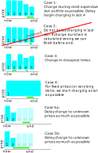

# Planner

The `planner` is responsible for developing a lowest-cost plan for charging a `required duration` until `target time`. A plan consists of a number of slots in ascending order of cost.
If the `planner` has an associated `tariff`, costs are derived from the tariff's prices. Without `tariff`, the planner will only evaluate time, but not cost.
The developed plan is then evaluated in terms of total cost and being "active". A plan is considered active when the current time is covered by one of the plan's slots.

## Cases

## Edge cases

If time goal can not be met, the planner creates a continuous plan until up to required duration.
